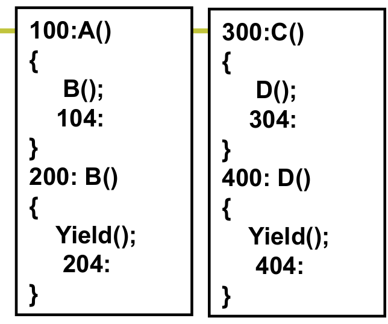
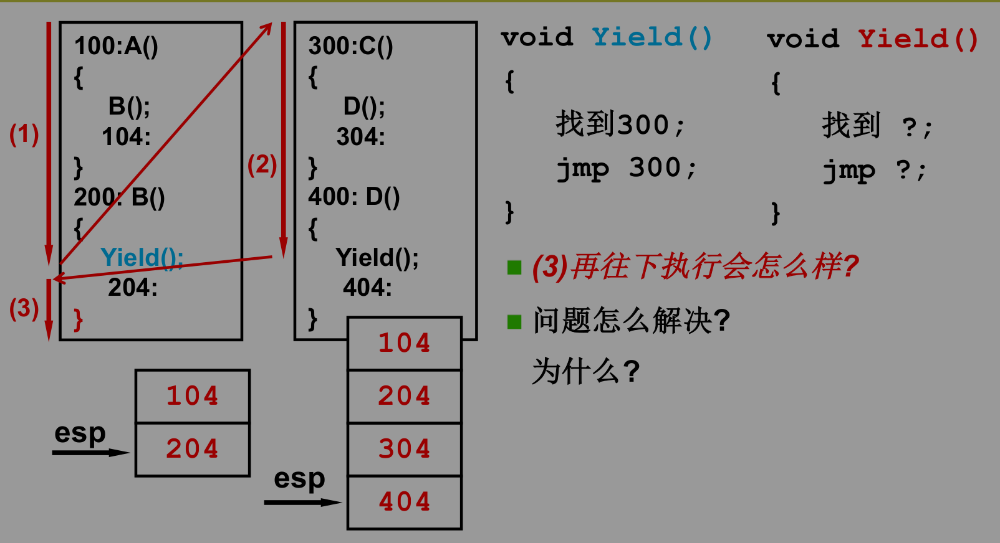
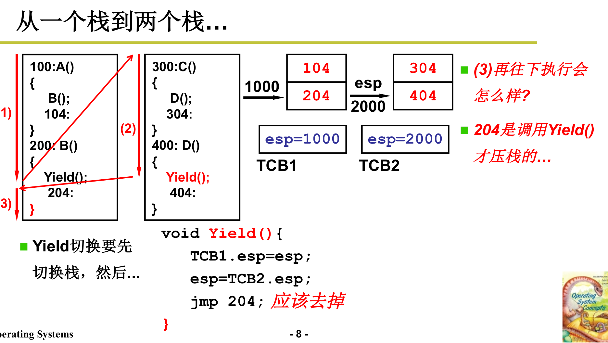
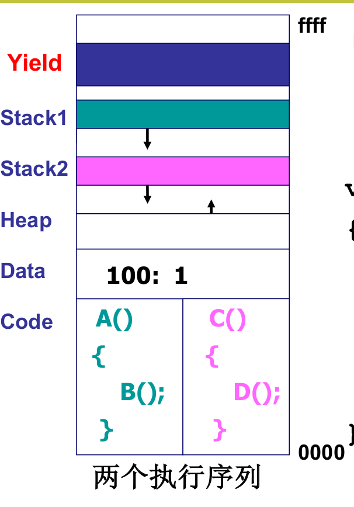
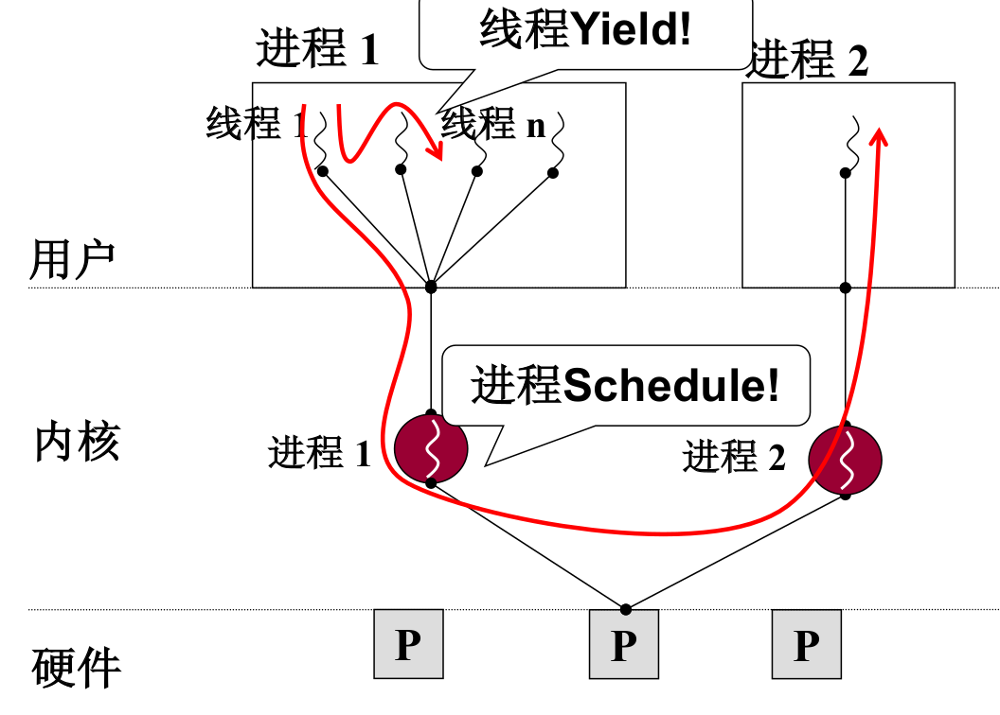
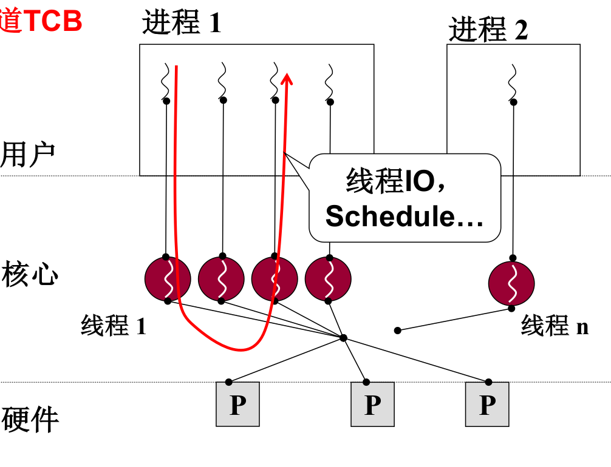

### l10 用户级线程
#### 是否可以资源不动而切换指令序列?
* 进程 = 资源 + 指令执行序列
    * 将资源和指令执行分开
    * 一个资源 + 多个指令执行序列
#### 线程
* 线程: 保留了并发的优点，避免了进程切换代价
* 实质就是映射表不变而PC指针变

#### 多个执行序列+一个地址空间是否实用?
* 一个网页浏览器
    * 一个线程用来从服务器接收数据
    * 一个线程用来显示文本
    * 一个线程用来处理图片(如解压缩)
    * 一个线程用来显示图片
* 这些线程要共享资源吗?
    * 接收数据放在100处，显示时要读..
    * 所有的文本、图片都显示在一个屏幕上
* 这些线程共用一个缓冲区

#### 开始实现这个浏览器…
```C
void WebExplorer()
{ 
    char URL[] = “http://cms.hit.edu.cn”;
    char buffer[1000];
    pthread_create(..., GetData, URL, buffer);
    pthread_create(..., Show, buffer); 
}
void GetData(char *URL, char *p){...};
void Show(char *p){...};
```


* 核心是Yield…
    * 能切换了就知道切换时需要是个什么样子
    * Create就是要制造出第一次切换时应该的样子
* 仔细看Yield，就是100跳到300


#### 两个执行序列与一个栈…

在这种情况下第二个Yield函数执行完毕弹栈返回的地址是404而不是204，无法返回到B函数，执行出错
#### 解决方法


#### 两个线程的样子：两个TCB、两个栈、切换的PC在栈中

```C
void ThreadCreate(A)
{
TCB *tcb=malloc();
*stack=malloc();
*stack = A;//100
tcb.esp=stack;
}
```

#### 为什么说是用户级线程——Yield是用户程序
* 如果进程的某个线程进入内核并阻塞，则操作系统不会执行Yield函数，而是会Schedule调度执行另外一个进程，该进程对CPU的利用率无法提高


#### 核心级线程
* ThreadCreate是系统调用，会进入内核，内核知道TCB

