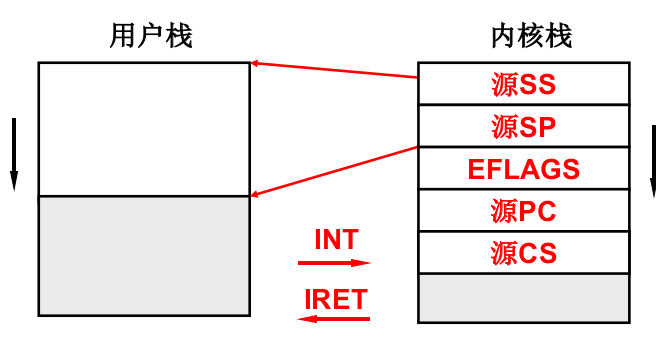
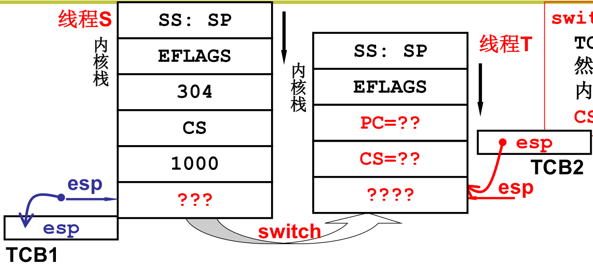

#### 和用户级相比，核心级线程有什么不同?
* ThreadCreate是系统调用，内核管理TCB，内核负责切换线程
* 如何让切换成型? - 内核栈，TCB
    * 用户栈是否还要用? 执行的代码仍然在用户态，还要进行函数调用
    * 一个栈到一套栈；两个栈到两套栈
    * TCB关联内核栈，那用户栈怎么办?

#### 用户栈和内核栈之间的关联
* 所有中断(时钟、外设、INT)都引起上述切换


#### 开始内核中的切换：switch_to

* switch_to:仍然是通过TCB找到内核栈指针;然后通过ret切到某个内核程序;最后再用CS:PC切到用户程序

#### 内核线程switch_to的五段论
##### 中断入口:(进入切换)
```assembly
push ds;... pusha;
mov ds, 内核段号; ...
call 中断处理
```
##### 中断处理:(引发切换)
启动磁盘读或时钟中断;
schedule();
}//ret
schedule: next=..;
call switch_to;
}//ret  
##### switch_to:(内核栈切换)
TCB[cur].esp=%esp;
%esp=TCB[next].esp;
ret;
##### 中断出口:(第二级切换)
popa;...; pop ds;
iret