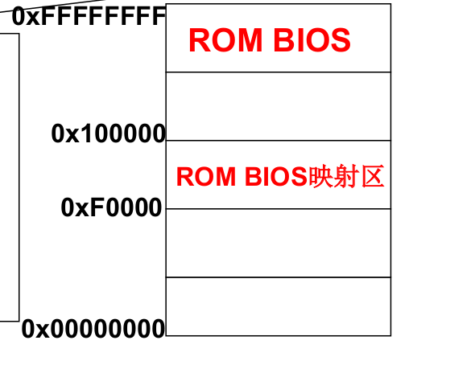

#### 操作系统是计算机硬件和应用之间的一层软件

#### 计算模型 => 我们要关注指针IP及其指向的内容
* 计算机刚打开电源时，IP=?
* 由硬件设计者决定!
* 看看x86 PC
    * x86 PC刚开机时CPU处于实模式   
    * 开机时，CS=0xFFFF; IP=0x0000
    * 寻址0xFFFF0(ROM BIOS映射区)
    * 检查RAM，键盘，显示器，软硬磁盘
    * 将磁盘0磁道0扇区读入0x7c00处
    * 设置cs=0x07c0，ip=0x0000
    

#### 0x7c00处存放的代码
* 就是从磁盘引导扇区读入的那512个字节
    * 引导扇区就是启动设备的第一个扇区
    * 启动设备信息被设置在CMOS中…
    * 因此，硬盘的第一个扇区上存放着开机后执行的第一段我们可以控制的程序。