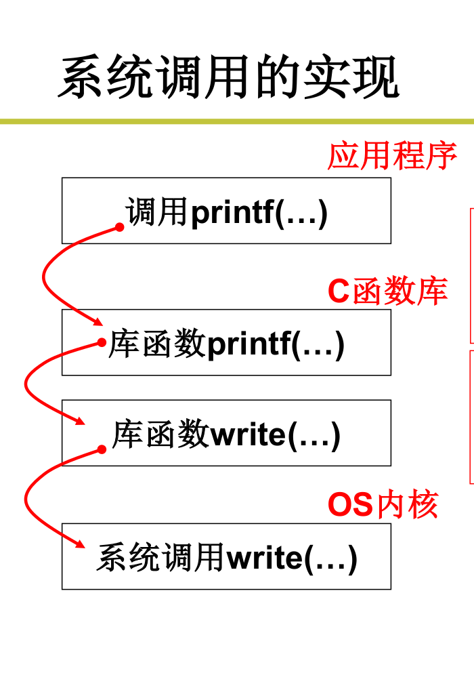

##### 用户态为什么要通过系统调用来执行操作系统内核的代码？为什么不直接通过jmp, mov来执行内核中的代码？
* 操作系统的内核存放着许多重要的数据，比如root的密码，或者通过显存直接看到别人word中的内容，因此用户态直接访问内核是不安全的
##### 通过什么手段阻止用户态访问内核代码？
* 硬件方面的直接设计，阻止用户态直接访问内核代码。
* DPL: Destination Privilege Level 目标特权级别
    * head.s初始化时GDT表中DPL等于0 
* CPL：Current Privilege Level 当前特权级别
    * 初始化结束进入用户态执行代码时CPL=3,存放于CS中
##### 当用户态需要使用内核中某些代码的功能时，应该怎么做？
* 硬件提供了“主动进入内核的方法”，对于Intel x86，那就是中断指令int
    * int指令将使CS中的CPL改成0，“进入内核”
    * 这是用户程序发起的调用内核代码的唯一方式
    * 系统调用的核心:
        * 用户程序中包含一段包含int指令的代码
        * 操作系统写中断处理，获取想调程序的编号
        * 操作系统根据编号执行相应代码
##### 系统调用的实现

##### 调用中断的入口是int 0x80
* 核心：将一个系统调用号置给eax，然后调用int 0x80
