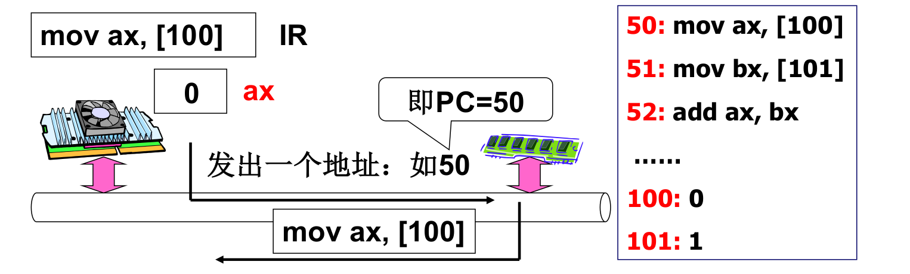
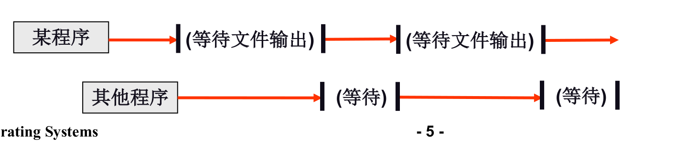
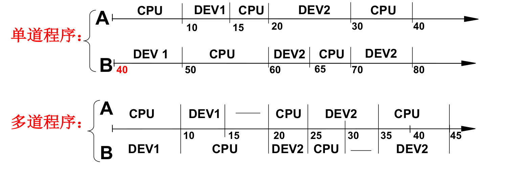
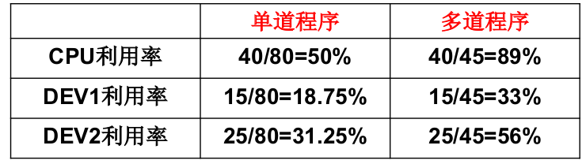
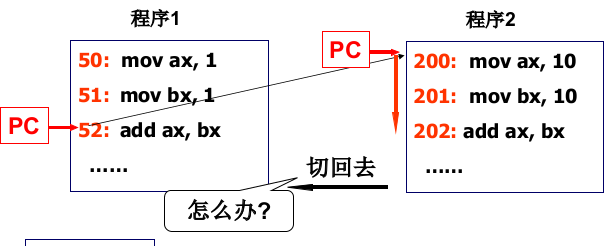
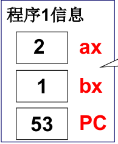

##### CPU的工作原理
* CPU上电以后发生了什么? 
    * 自动的取指—执行
* CPU怎么工作?
* CPU怎么管理?

##### 管理CPU的最直观方法
* 设好PC初值就完事!直接让PC顺序执行

##### 可能遇到的问题

* 程序在IO过程中等待时间过长，CPU利用率较低

##### 解决办法
* 多道程序、交替执行
* 一个CPU上交替的执行多个程序：并发

* 直接修改PC可行吗？
    * 运行的程序与静态的程序不一样，有各种信息需要保存
    * 要记录返回地址，要记录ax…
    * 每个程序有了一个存放信息的结构: PCB

##### 引入“进程”概念
* 运行的程序和静态程序不一样
    * 需要描述这些不一样…
    * 程序 + 所有这些不一样 --> 一个概念
    * 所有的不一样都表现在PCB中
* 进程是进行（执行）中的程序
    * 进程有开始、有结束，程序没有
    * 进程会走走停停，走停对程序无意义
    * 进程需要记录ax,bx,…，程序不用

