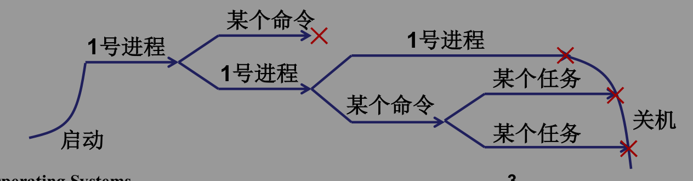
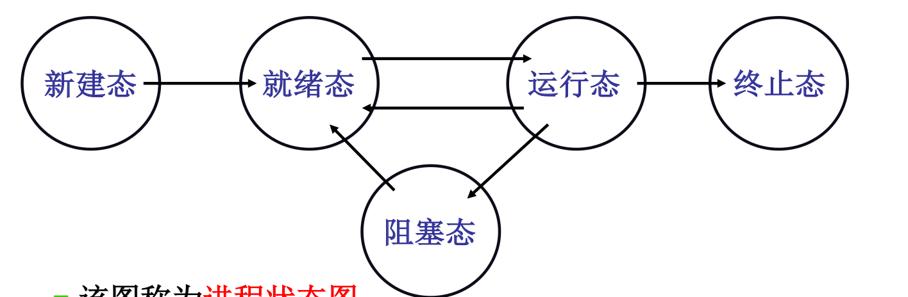
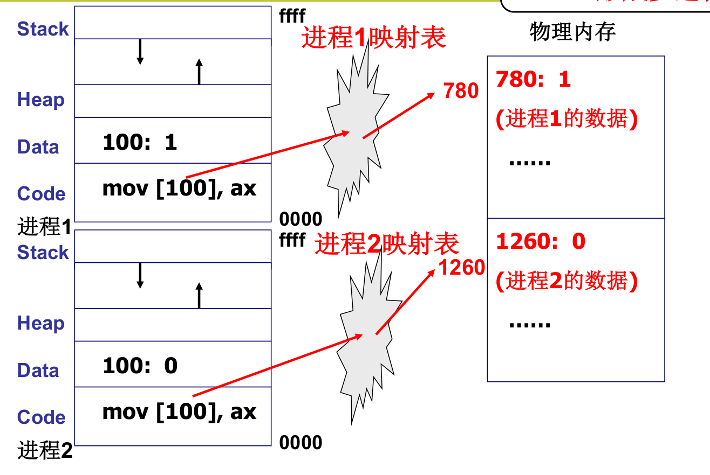

#### 多个进程使用CPU的图像
* 如何使用CPU呢?
    * 让程序执行起来
* 如何充分利用CPU呢?
    * 启动多个程序，交替执行
* 启动了的程序就是进程，所以是多个进程推进
    * 操作系统只需要把这些进程记录好、要按照合理的次序推进(分配资源、进行调度)
    * 这就是多进程图像…

#### 多进程图像从启动开始到关机结束
* main中的fork()创建了第1个进程
    * init执行了shell(Windows桌面)
* shell再启动其他进程
```C
int main(int argc, char * argv[])
{
    while(1) {      //死循环
        scanf(“%s”, cmd);
        if(!fork()) {
            exec(cmd);
        } 
        wait();
    } 
}
```


#### PCB（Process Control Block）: 用来记录进程信息的数据结构

#### 多进程的组织：PCB+状态+队列
* 运行 -> 等待; 运行 -> 就绪; 就绪 -> 运行……
* 它能给出进程生存期的清晰描述
* 它是认识操作系统进程管理的一个窗口


#### 多进程图像：多进程如何影响？
* 多个进程同时在存在于内存会出现下面的问题

* 进程一对内存地址[100]存放数据的改变破坏了进程二的代码
* 解决的办法：限制对地址100的读写
* 多进程的地址空间分离：内存管理的主要内容

#### 解决方法：内存管理


#### 多进程图像：多进程如何合作？
* 想一想打印工作过程
    * 应用程序提交打印任务
    * 打印任务被放进打印队列
    * 打印进程从队列中取出任务
    * 打印进程控制打印机打印

#### 从纸上到实际：生产者-消费者实例
共享数据
```C
#define BUFFER_SIZE 10
typedef struct { . . . } item;
item buffer[BUFFER_SIZE];
int in = out = counter = 0;
```

生产者进程
```C
while (true) {
    while(counter== BUFFER_SIZE)    break;
    buffer[in] = item;
    in = (in + 1) % BUFFER_SIZE;
    counter++;
}
```

消费者进程
```C
while (true) {
    while(counter== 0)  break;
    item = buffer[out];
    out = (out + 1) % BUFFER_SIZE;
    counter--;
}
```

#### 两个合作的进程都要修改counter
初始情况
```C
counter = 5;
```

生产者P
```C
register = counter;
register = register + 1;
counter = register;
```

消费者
```C
Cregister = counter;
register = register - 1;
counter = register;
```

一个可能的执行序列
```C
P.register = counter;
P.register = P.register + 1;
C.register = counter;
C.register = C.register - 1;
counter = P.register;
counter = C.register;
```
该执行序列结束后counter的值为4,消费者C对Counter的修改覆盖了生产者P对Counter的修改，出现了错误

#### 核心在于进程同步(合理的推进顺序)
* 写counter时阻断其他进程访问counter
生产者P
```C
//给counter上锁
P.register = counter;
P.register = P.register + 1;
```
消费者C
```C
//检查counter锁
```
生产者P
```C
counter = P.register;
//给counter开锁
```
消费者C
```C
//给counter上锁
C.register = counter;
C.register = C.register - 1;
counter = C.register;
//给counter开锁
```
#### 如何形成多进程图像？
* 读写PCB，OS中最重要的结构，贯穿始终
* 要操作寄存器完成切换（L10，L11，L12）
* 要写调度程序（L13，L14）
* 要有进程同步与合作（L16，L17）
* 要有地址映射（L20）
